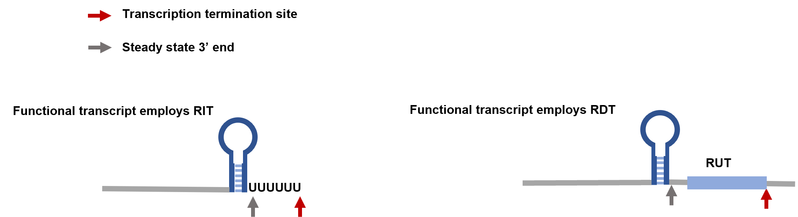

# BATTER

## Introduction

### Background in bacterial transcription termination
- Two mechanisms, Rho-independent terminations (RITs) and Rho-dependent terminations (RDTs), contribute to transcription terminations in bacteria. RITs are relatively easy to predict, but current methods are mostly optimized for a few model organisms. Rho protein binds to RUT (Rho utilization) sites and induces RDT. RUTs lack a compact sequence pattern and are hard to predict.
- The 3' end of the functional transcript is often associated with a stem loop structure, which is thought to prevent exonuclease degradation and maintain transcript integrity. This fact holds for 3' ends generated by both RITs and RDTs.
- As shown below
  - For RIT, RIT itself serves as this protective stem loop, which marks the transcript 3' end.
  - For RDT, RUT site, where transcription termination actually happens, is often located downstream of the transcript 3' ends marked by the protective stem loop.  
  - **The prediction of primary transcript 3' ends is an easier task**.


### When to use BATTER
- BATTER (**BA**cteria **T**ranscript **T**hree prime **E**nd **R**ecognizer) is a tool for bacterial transcription termination prediction. It was designed to predict 3' ends of primary transcript (both RIT and RDT) across diverse species in bacteria domain. 
- If you want to predict 3' ends of functional transcripts generated by primary termination events, or RIT-based regulatory premature termination events, consider the `batter-tpe` program in `BATTER`. `batter-tpe` is a machine learning model based on BERT-CRF architecture.
- If you want to search RUT-like sequences, consider the `batter-rut` program in `BATTER`. `batter-rut` uses a rule-based algorithm to search RUT patterns, that is, regularly spaced YC (UC/CC) dimers. In general, `batter-rut` has a higher false positive rate, but it can provide useful insights when considering specific genomic regions, such as the downstream sequence of 3' ends predicted by `batter-tpe`.


## Installation

### Download

- Download this repo:

```bash
git clone https://github.com/lulab/BATTER 
```


### Automatic installation of the dependency (recommended)

- We recommend using conda for the installation of the dependency
- After installing [conda](https://docs.conda.io/en/latest/), type:
 
```{bash}
conda env create -f environment.yml
```

- By default, a conda env called batter-env will be created
- If you want to use an alternative name, edit the 'name' field in `environment.yml`

### Manual installation of the dependency

- You can also manually install each of the packages if you want
- The following python packages are required:
  - [pytorch](https://pytorch.org/): test on version `1.7.0+cu110`, other version should work
  - [transformers](https://huggingface.co/docs/transformers/index): version `4.18.0`
  - [pyfaidx](https://pythonhosted.org/pyfaidx/): test on version `0.7.1`
  - [pandas](https://pandas.pydata.org/): test on version `2.0.3`

- The following tools are optional:
  - [bedtools](https://bedtools.readthedocs.io/), for annotation of predictions

### Using containers

- If you have trouble installing the dependency, you can also use the following docker container

```{bash}
docker pull jinyf1998/batter:v0.0
```

- If you are not in docker user group, you may also consider [apptainer](https://github.com/apptainer/apptainer)

```{bash}
apptainer pull batter.sif docker://jinyf1998/batter:v0.0
```

## Usage

- `BATTER` takes bacterial genome sequences (can be contigs or complete/draft genomes) as input, and produces predicted terminator coordinate and strand information with confidence scores in bed format
- Two modules, `batter-tpe` and `batter-rut` are available. 
- Here we take Escherichia coli str. K-12 substr. MG1655 (https://ftp.ncbi.nlm.nih.gov/genomes/all/GCF/000/005/845/GCF_000005845.2_ASM584v2/) as an example. 

### Setup environment

- If you are using conda:

```{bash}
conda activate batter-env
```

- If you are using docker:

```{bash}
docker run -it --gpus 1 -v $(pwd):/workspace --rm batter:v0.0 /bin/bash
conda activate batter-env
```

- If you are using apptainer

```{bash}
# sif is the path of image
apptainer exec --nv -B $(pwd) batter.sif /bin/bash
conda activate batter-env
```

### batter-tpe

- Genome-wide prediction of transcript 3' ends. The following command takes around 2 min to finish on a nvidia V100 GPU.

```bash
# take Escherichia coli str. K-12 substr. MG1655 GCF_000005845.2
# The default batch size is 256. If the GPU memory is limited, please use a smaller batch size, eg. 64
# The following command takes around 2 min to finish on a nvidia V100 GPU.
scripts/batter-tpe --fasta examples/e.coli/genome.fna --output examples/e.coli/TPE.bed --device cuda:0
```

- If you get error 'libtorch_cpu.so: undefined symbol: iJIT_IsProfilingActive', this likely results from a discrepancy between the version of pytorch and mkl (It can happen when using manual installation and the dependency is not correctly resolved), considering downgrading mkl by running `conda install mkl=2023 mkl-include=2023 -c conda-forge`

- The output has 7 fields (the 1-6 columns are in standard bed format)
  1. contig / chromosome name
  2. start position
  3. end position
  4. ID of predicted 3' end
  5. score of the prediction
  6. strand
  7. estimated number of false positives per kilobase

- Notes
  - BATTER scans both strands by default; if you only need to scan the top strand, use `-nrc` option.
  - If you want to keep the temporary file, use `--keep-temp`/`-kt` option. You can also specify the path of the temporary file with the parameter `--tmp-file`
  - If more efficient scanning (at the cost of lower sensitivity) is desired, you can increase the step size (100 nt by default) for scanning 

### batter-rut
- Prediction of putative RUT sites in specified regions

```bash
# predict 
scripts/batter-rut -i examples/e.coli/genome.fna -ivs examples/e.coli/TPE.bed --left-slop 100 --right-slop 200 --output examples/e.coli/TPE.RUT.bed
```

- The output has 7 fields (the 1-6 columns are in standard bed format)
  1. contig / chromosome name
  2. start position
  3. end position
  4. ID of predicted 3' end
  5. score of the prediction
  6. strand
  7. score at the candidate identification stage
  8. estimated number of false positives per kilobase

### Annotation

- Computational annotation of prokaryotic genomes, especially annotation of protein-coding genes, is relatively reliable, and you can annotate predicted terminators with their relative position to protein coding gene
- You can download bacteria genome annotation from ncbi, or perform annotation using tools like [prokka](https://github.com/tseemann/prokka). You'll get a file in gff format.

- Convert CDS annotation to bed format

```bash
# convert gff format to bed format
scripts/gff2bed.py --gff examples/e.coli/genes.gff --bed examples/e.coli/genes.bed --feature CDS --name ID
# make sure the genes are sorted by coordinate
sort -k1,1 -k2,2n -o examples/e.coli/genes.bed examples/e.coli/genes.bed
``` 
- Annotate predicted terminators with protein coding genes
<div align="center">

</div>

```bash
scripts/annotate-intervals.py --gene examples/e.coli/genes.bed --bed examples/e.coli/TPE.bed --contig examples/e.coli/genome.fna.fai --output examples/e.coli/TPE.annotated.bed
scripts/annotate-intervals.py --gene examples/e.coli/genes.bed --bed examples/e.coli/TPE.RUT.bed --contig examples/e.coli/genome.fna.fai --output examples/e.coli/TPE.RUT.annotated.bed
```
- Explanation  of the output:
  1. contig id    
  2. start     
  3. end  
  4. ID
  5. score
  6. strand
  7. direction
  8. relative distance to upstream gene and to downstream gene, separated by a comma
  9. whether the strand is the same (concordant) or different (discordant) with the associated gene
  10. location relative to CDS, one of the leader, downstream, genic, or intergenic
  11. fraction overlap with CDS

## Citation

Yunfan, J., et al., Conserved 3’ Stem-Loop Structures Enable Comprehensive Analysis of Bacterial Transcription Termination in Metagenomes, Regardless of Rho Factor Dependency. bioRxiv, 2023: p. 2023.10.02.560326.
